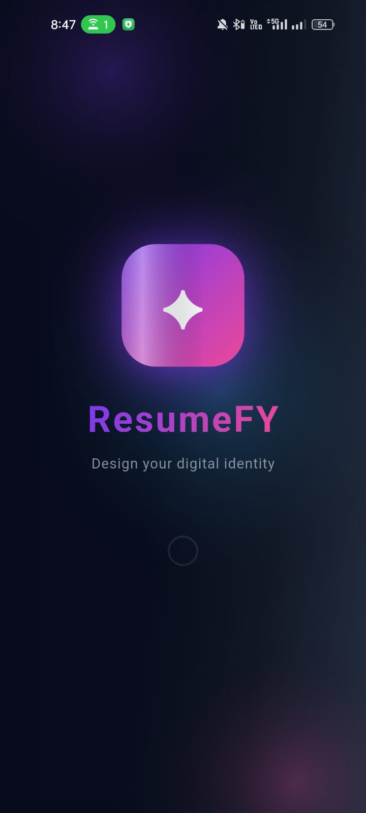
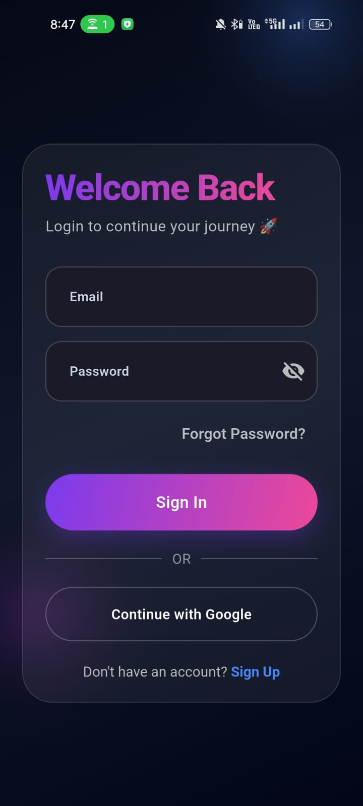
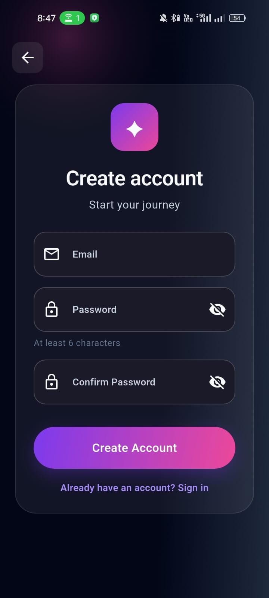
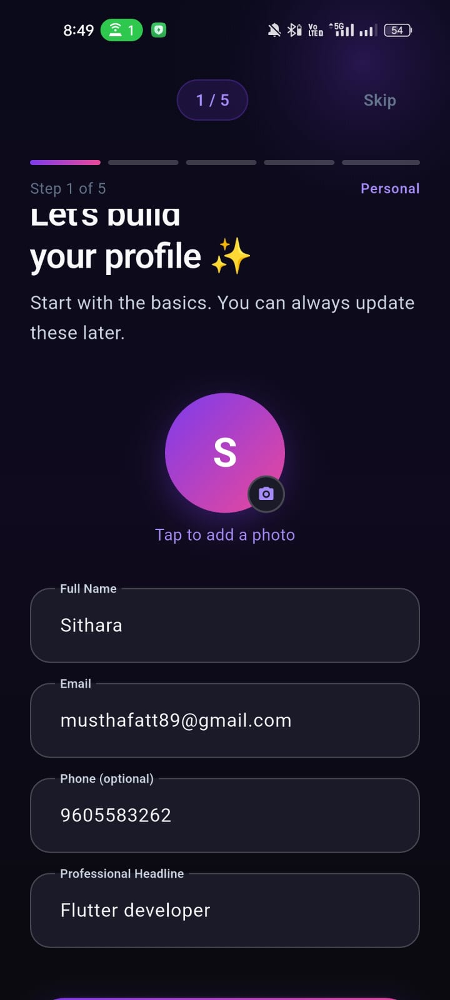
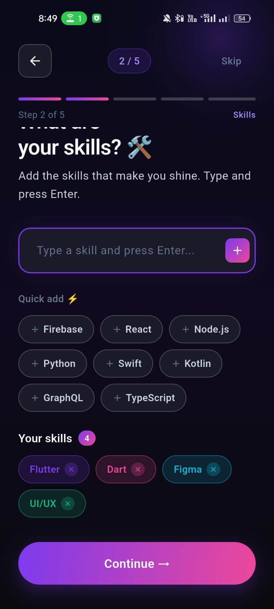
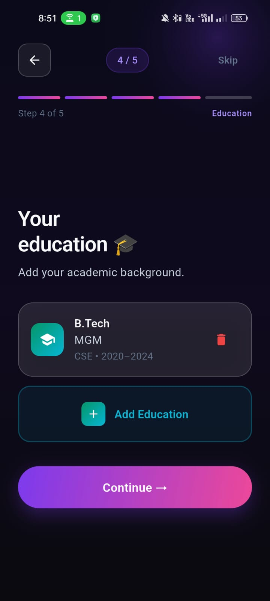
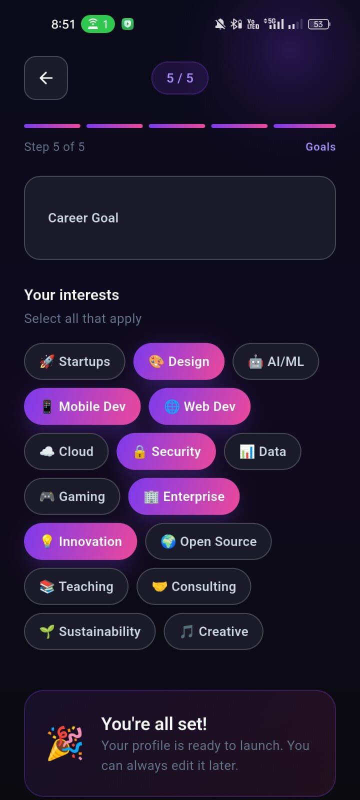
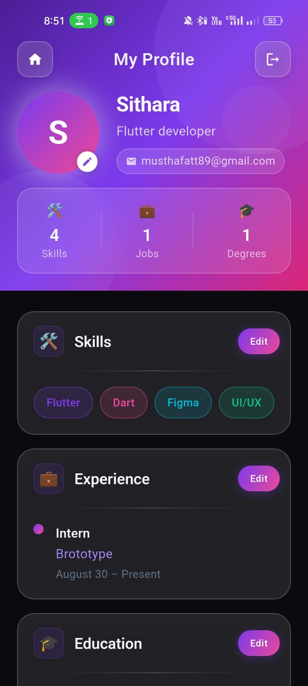
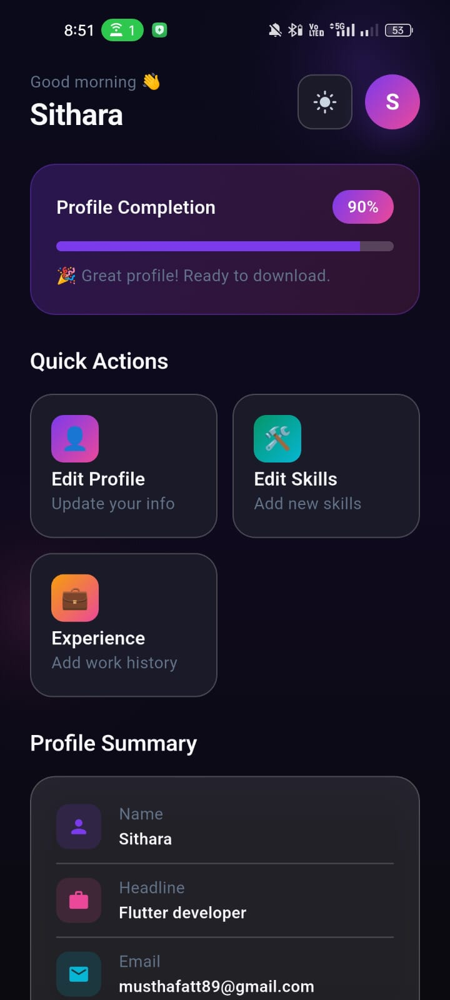

# ✨ Resumefy — Build Your Stunning Digital Profile

<p align="center">
  <b>Create. Showcase. Impress.</b><br/>
  A beautifully crafted Flutter app to build and manage your professional profile.
</p>

---

## 🚀 Overview

**Resumefy** is a modern, elegant Flutter application designed to help users create and manage their personal and professional profiles with ease.

From skills and experience to education and career goals — everything is presented in a clean, aesthetic UI that feels premium and smooth.

---

## 🌟 Features

✨ **Beautiful Profile UI**

* Glassmorphism cards
* Gradient hero header
* Smooth animations

🧠 **Smart Profile Management**

* Add skills, experience, education
* Update goals & interests
* Live profile updates using streams

🔐 **Authentication System**

* Secure login & logout
* Firebase authentication integration

⚡ **State Management (Riverpod)**

* Clean architecture
* Reactive UI updates
* Scalable and maintainable code

🎯 **Modern UX**

* Minimal design
* Smooth navigation (GoRouter)
* Responsive layout

---

## 📸 Screenshots

<p align="center">
  
  
  
  
  
  
  
  
  
</p>

> 💡 Tip: Add your screenshots inside `assets/screenshots/` and update paths if needed.

---

## 🏗️ Project Structure

```
lib/
├── core/
│   ├── constants/
│   ├── routes/
│
├── data/
│   ├── models/
│
├── presentation/
│   ├── auth/
│   ├── profile/
│
├── providers/
│
├── widgets/
│   ├── common/
│   ├── cards/
│
└── main.dart
```

---

## 🛠️ Tech Stack

* **Flutter**
* **Riverpod**
* **Firebase Auth**
* **GoRouter**
* **Material UI + Custom Design System**

---

## ⚙️ Getting Started

### 1️⃣ Clone the repo

```bash
git clone https://github.com/your-username/resumefy.git
cd resumefy
```

### 2️⃣ Install dependencies

```bash
flutter pub get
```

### 3️⃣ Run the app

```bash
flutter run
```

---

## 🔥 Firebase Setup

1. Create a Firebase project
2. Add Android/iOS app
3. Download `google-services.json` / `GoogleService-Info.plist`
4. Place inside project

---

## 🎨 UI Highlights

* 💎 Glassmorphic cards
* 🌈 Gradient accents
* 🧊 Soft shadows & blur effects
* 📱 Pixel-perfect layouts

---

## 📌 Future Improvements

* 📄 Resume PDF export
* 🌐 Portfolio sharing
* 🧑‍💼 Multi-theme support
* 🧠 AI resume suggestions

---

## 🤝 Contributing

Pull requests are welcome!
If you’d like to improve UI, fix bugs, or add features — go ahead.

---

## 📜 License

This project is licensed under the MIT License.

---

## ❤️ Made With Flutter

<p align="center">
  <b>If you like this project, give it a ⭐ on GitHub!</b>
</p>
